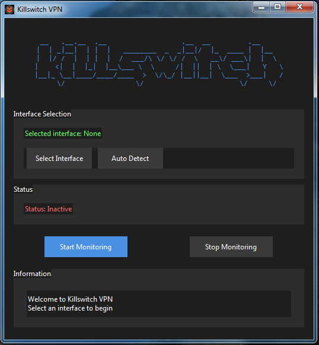

# Killswitch VPN

A Windows application that monitors your VPN connection and automatically disables internet access if the VPN connection drops, ensuring your real IP is never exposed.

## Features

- 🛡️ Real-time VPN connection monitoring
- 🔌 Automatic internet disconnection on VPN failure
- 🔍 Auto-detection of VPN interfaces
- 🎨 Dark theme UI with intuitive controls
- 📝 Detailed logging for troubleshooting
- 🔔 Audible alerts for connection changes

## Requirements

- Python 3.7+
- Windows OS
- Required Python packages (install via `pip install -r requirements.txt`):
